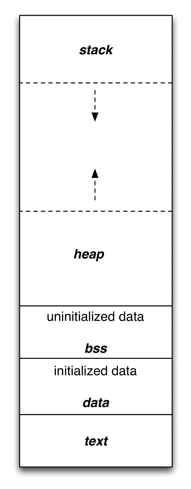

# memory layout of a Program

 

***Code segment (text segment)***: nơi chứa mã máy (mã nhị phân) của chương trình.

***Data segment***: nơi chứa các biến tĩnh (static type var) và biến toàn cục. Gồm *uninitialized data (bss)* nơi chứa các biến được khởi tạo với giá trị bằng 0 (hoặc giá trị "rác") và *initialized data* nơi chứa các biến được khởi tạo với giá trị khác 0.

***Heap***: vùng nhớ không do CPU quản lý, người dụng phải tự quản lý vùng nhớ này. Hay nói các khác, đây là vùng nhớ dành cho con trỏ. Ở đây, ta control được quá trình cấp phát hoặc giải phóng bộ nhớ bằng các lệnh như malloc, calloc, relloc, free, new, delete,...

***Stack***: vùng nhớ do CPU quản lý, người dùng không được phép can thiệp vào vùng nhớ này. Vùng nhớ này chứa các biến cục bộ.