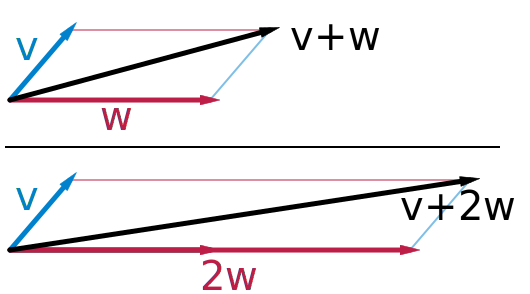
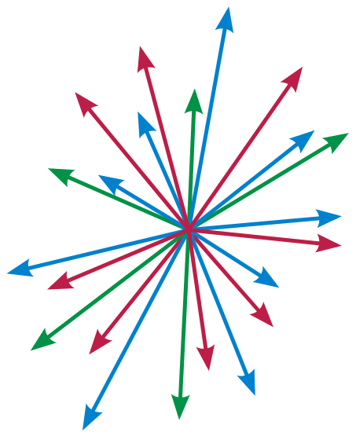

# Vector (math)

Khi kiến thức vector chưa được xây dựng một cách có hệ thống, ý tưởng về những *"đoạn thẳng định hướng"* đã sớm xuất hiện rất nhiều trong các công trình cơ học, hay khi có số phức, người ta cũng hình thành nên ý tưởng biễu diễn số phức dưới dạng hình học là những đoạn thẳng định hướng,... khiến nó trở thành đối tượng đáng quan tâm trong mắt các nhà toán học thế kỷ 19 như một điều thiết yếu.

Một đoạn thẳng được định hướng trong không gian Euclid (không gian phẳng) bởi hai điểm đầu mút của nó khi một trong hai được xác định là điểm đặt (điểm đầu) của đoạn thẳng và điểm còn lại sẽ là điểm tới (điểm cuối) của đoạn thẳng, các đối tượng hình học như vậy có ý nghĩa về *"độ dài và hướng"* đại diện biểu thị cho các đại lượng có hướng và được gọi là *"Vector"*.

Một vector v được viết kí hiệu: $\mathbf{v}$ (v in đậm) hoặc $\vec{\text{v}}$

####

####

hoặc khi đề cập đến độ dài hoặc độ lớn của nó ta viết: $\vert \mathbf{v}\vert$ hoặc $\vert \vec{\text{v}}\vert$, đôi khi $\Vert \mathbf{v}\Vert$ hoặc $\Vert \vec{\text{v}} \Vert$,...

nói chung, trong không gian Euclid:

*\- các vector cùng nằm trên các đường thẳng song song với nhau hoặc trùng nhau được gọi là các vector cùng phương, chúng có thể cùng chiều hoặc ngược chiều*.

*\- các vector cùng hướng là các vector cùng phương, cùng chiều.*

*\- các vector bằng nhau là các vector có cùng độ dài, cùng hướng.*

*\- các vector đối nhau là các vector có cùng độ dài, cùng phương nhưng ngược chiều.*

Ở một góc nhìn hình học khác, một vector giống như một *"bản báo cáo sự thay đổi vị trí của một điểm trong không gian từ vị trí này tới vị trí kia"*. Theo ý đó, khi cho hai vector được kết hợp theo cách mà đầu của vector này được nối với đuôi của vector kia, sau đó luôn có thể có được một đoạn thẳng nối từ *"đầu còn lại"* tới *"đuôi còn lại"* của chúng hình thành một vector là *"tổng ý"* của hai vector đã dựng. Do đó, hai hoặc các vector đã cho trong một phép dựng hình như vậy được nhìn nhận như một phép cộng giữa các vector theo một quy tắc hình học gọi là *"quy tắc các hình tam giác".*

Mặt khác, chúng ta cần nhớ rằng, với bản chất của phép cộng, phép cộng giữa các đối tượng không có cùng định nghĩa, hoặc không có cùng bản chất, thì phép tính đó vô nghĩa. Giống như các đối tượng có bản chất số học được tập hợp trong cùng một tập hợp có bản chất số học, chẳng hạn: $\mathbb{N}\subset\mathbb{Z}\subset\mathbb{Q}\subset\mathbb{R}\subset\mathbb{C}\subset...\subset S_\text{numbers}$:

Với các vector cũng vậy, các vector mà được cho là *"bằng nhau"*, dù đặt ở vị trí nào trong không gian đi nữa thì ở góc nhìn toán học nói chung, chúng phải được định nghĩa rằng: *"đây là một phần tử xác định trong một tập có định nghĩa chứa các đối tượng có bản chất vector (các vector khác), gọi là tập hợp* $V$*"*.

Theo đó, trên một góc nhìn tổng quát hơn, phép cộng giữa các vector bất kì có thể được thực hiện theo một quy tắc hình học bao hàm cả *quy tắc các hình tam giác* được gọi là *"quy tắc các hình bình hành"*:

## Vector đơn vị

Trong không gian Euclide, vector có độ dài được quy ước bằng 1 được gọi là vector đơn vị (vector cơ sở), kí hiệu: $\hat{\mathbf{u}}$, với $\hat{\mathbf{u}}=\frac{\mathbf{v}}{\Vert \mathbf{v} \Vert}.$

## Không gian Vector

Trong [*Đại số trừu tượng*](https://en.wikipedia.org/wiki/Abstract_algebra), tập hợp $V$ mà ta nói đến bên trên được trừu tượng hoá thành đối tượng được gọi là *Không gian vector (vector space)*.

Không gian vector là một sự trừu tượng hoá trên sự kết hợp giữa tập $V$ và trường vô hướng $F.$

Trong không gian vector, mỗi vector xác định, được coi như kết quả của *"sự xoay, hoặc sự co giãn và xoay"* bởi phép cộng giữa các phần tử trên tập $V$ nói chung theo quy tắc các hình bình hành, hoặc *"sự co giãn"* bởi phép cộng giữa các phần tử trên tập $V$ có cùng hướng, phép cộng giữa các phần tử có cùng hướng như vậy còn được hiểu là phép nhân giữa một phần tử tập $V$ với một phần tử trường $F$ *(scalar multiplication, đừng nhầm lẫn với [scalar product](#)):*

$+:V\times V \rightarrow V$

$\times: F\times V \rightarrow V$