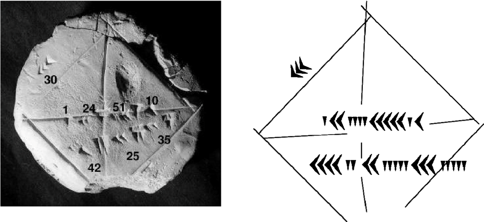

**Calculus** là kết quả công trình của nhiều nhà Toán học thuộc nhiều thế hệ trước đó, thậm chí từ trước Tây Lịch (trước TL).

**1600 (trước TL)** Qua các giấy bản cổ (Rhind Papyrus), người ta biết được rằng người Ai-Cập cổ đại đã biết thể tích hình chóp đáy chữ nhật bằng một phần ba thể tích hình lăng trụ có cùng đáy và cùng chiều cao, nghĩa là thể tích hình chóp bằng một phần ba diện tích đáy nhân với chiều cao. Tuy nhiên người Ai-Cập cổ đại đã không giải thích công thức này. Người Babylon thời ấy, qua các bảng đất sét nung, đã có công thức tính được căn bậc hai của số hữu tỷ và viết giá trị thập phân của $\sqrt{2}$ đến bao nhiêu chữ số tùy ý, nhưng họ không biết rằng quá trình ấy là vô hạn.

Tấm đất sét mang tên *YBC7289 (Yale Babylonian Collection)* có hình một hình vuông cạnh bằng 1 và độ dài đường chéo của nó:

**425 – 200 (trước TL)** Eudoxus (khoảng 390 – 337 trước TL), nhà Toán học Hy-Lạp, đã phát minh ra phương pháp “vét cạn” (method of exhaustion) để tìm diện tích hình phẳng và thể tích hình chóp. Archimedes (khoảng 287 – 212 trước TL) đã tìm ra được cách tính diện tích một phần parabol (parabola segment).

**320 (Sau TL)**

Pythagoras: “mọi thứ trong thế giới đều phải được mô tả bởi các số nguyên và các tỷ số giữa chúng”.

Hyppasus: “Có rất nhiều hình vuông mà đường chéo của chúng không thể so sánh với cạnh tương ứng”.

**Thế kỷ thứ 16** một thế hệ mới các nhà toán học người Hà Lan (Simon Stevin), Anh (Thomas Harriot, John Wallis) và đặc biệt là Ý (Bonaventura Cavalieri, Evangelista Torricelli) bắt đầu thử tìm sự khác biệt giữa những điểm rời rạc và các đại lượng liên tục như đường thẳng, mặt phẳng, khối lập thể. Điều gì sẽ xảy ra nếu như các đường thẳng là tập hợp của những điểm với kích thước nhỏ vô tận (vô cùng bé)? Còn mặt phẳng là tập hợp của vô tận các đường thẳng như thế kế cận nhau? Hình khối thì là vô tận các mặt như vậy xếp chồng lên nhau?

Kết quả là họ đã giải quyết được rất nhiều bài toán hóc búa như tính được chiều dài của các đường cong bất kỳ, tìm được độ nghiêng của chúng cũng như tính được diện tích của các mặt phẳng và thể tích của các hình khối. Những điều này là không thể làm được nếu như vẫn áp dụng các kiến thức toán học Hình học xưa cũ.

**1630 Bonaventura Cavalieri (1598 – 1647)** phát minh ra phương pháp chia nhỏ (method of indivisibles) để tính diện tích hình phẳng, tiền thân của phương pháp tính diện tích hình phẳng bằng tích phân sau này.

**Pierre de Fermat (1607 – 1665)**, nhà Luật học và Toán học Pháp, năm 1630 cho công bố tác phẩm *Methodus ad disquirendam maximam et minimam et de tangentibus linearum curvarum*, đây được xem như là nền tảng giúp cho René Descartes xây dựng nên ngành Hình học Giải tích. Ngoài ra cũng trong tác phẩm này, Fermat có đề ra phương pháp tính cực đại và cực tiểu cũng như vấn đề tiếp tuyến của đường cong.

**Isaac Barrow (1630 – 1677)**, thầy của Newton tại Đại học Cambridge, trong những năm 1650 -1660, qua những bài giảng Geometrical Lectures, đã tìm ra nhiều kết quả quan trọng trong việc phát triển phép tính Vi-phân và các vấn đề tiếp tuyến với đường cong. Ông còn được ghi công đầu trong việc tìm ra công thức cơ bản của tích phân cho phép tính được diện tích hình dưới đường cong $y = f(x)$ (sau này thường được gọi là công thức Newton-Leibniz).