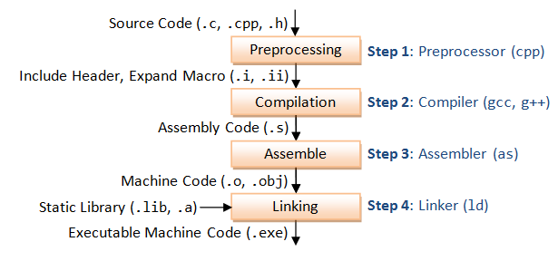

# compi

## g++

`g++ filename.cpp -o filename`, `g++ filename.cpp filename_1.cpp filename_2.cpp ... filename_n.cpp -o filename`:
bien dich cac file .cpp thanh cac file .o va truc tiep lien ket cac file .o tao ra tep thuc thi chuong trinh (filename.exe)

`g++ -c filename.cpp`, `g++ -c filename.cpp filename_1.cpp filename_2.cpp ... filename_n.cpp`: 
bien dich cac file .cpp thanh cac file .o

`g++ -S filename.cpp`, `g++ -S filename.cpp filename_1.cpp filename_2.cpp ... filename_n.cpp`: 
bien dich cac file .cpp thanh cac file .s

`g++ filename.o -o filename`, `g++ filename.o filename_1.o filename_2.o ... filename_n.o -o filename`:
lien ket cac file .o tao ra tep thuc thi chuong trinh (filename.exe)

# main

main function is a "program" function.

# function prototype

code style.
